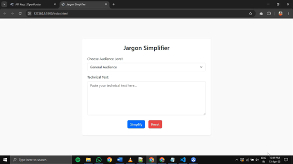
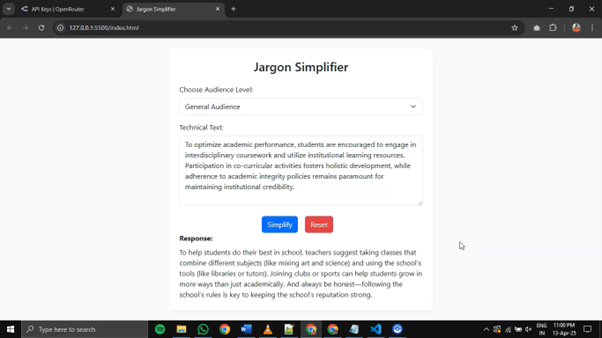

# 🧠 Jargon Simplifier

A simple and smart web application that simplifies complex or technical text using Large Language Model (LLM) APIs. Built for **Prompt Engineering Project 2**.

---

## 🚀 Features

- Simplifies technical jargon into plain English
- Supports multiple audience levels (10-year-old, general audience, non-technical friend)
- **Reset button** to clear inputs instantly
- **Lottie animation** while waiting for API response
- Uses **moonshotai/kimi-vl-a3b-thinking:free** via OpenRouter
- Clean, centered UI using Bootstrap 5

---

### Set Your OpenRouter API Key

1. Go to [https://openrouter.ai](https://openrouter.ai)
2. Create an account and generate your API key.
3. Paste it into config.js file.

---

## 🧠 Prompt Engineering

This app uses a dynamically generated prompt based on user input and selected audience. Here's how the prompt is formed internally:

```js
const prompt = `Simplify the following technical text for a ${audience}:\n\n"${inputText}"\n\nAvoid jargon and make it easy to understand. Only respond in plain English.`;
```
- ${audience} is selected from a dropdown (e.g., 10-year-old, general audience, non-technical friend)
- ${inputText} is what the user types into the textbox
- The prompt ensures the model avoids jargon and explains clearly in plain English

---

## 🛠️ Tech Stack

- **Frontend**: HTML, CSS, JavaScript, Bootstrap 5
- **LLM API**: [OpenRouter](https://openrouter.ai)
- **Animation**: Lottie (local JSON file)
- **Hosted Locally / GitHub Pages**

---

## 📸 Screenshots




---

## ✍️ How It Works

1. User enters complex or technical text.
2. Chooses target audience (e.g., general audience).
3. Clicks **Simplify**.
4. The app sends a prompt to the LLM API.
5. The simplified response is shown in clean English.